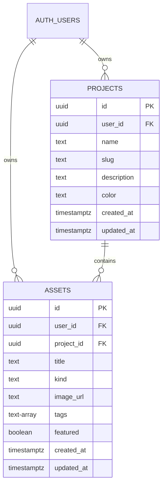

# StudioFlow

StudioFlow is a secure asset-planning dashboard for a small creative team. It manages projects and visual assets, makes the work visible through useful charts, and isolates every account's records with Supabase Auth and Row Level Security (RLS).

This is the Assignment 2 submission. The assessment experience lives at `/studio`; the application root redirects there so reviewers land directly on it. The imported photography portfolio remains in the repository as the visual/component foundation, but it is not the submission surface.

## Live deployment

[Open StudioFlow](https://studioflow-alba.vercel.app) — currently showing the intentional Supabase setup guard until the publishable key is connected and the schema is applied.

The Supabase project URL is already configured in the Vercel Development, Preview, and Production environments. The remaining hosted setup is deliberately manual: add the project's publishable (anon) key in Vercel, run `supabase/schema.sql` in the Supabase SQL Editor, then redeploy the project.

## Product features

- Email/password sign-up and sign-in with Supabase Auth.
- Full CRUD for projects and assets with optimistic updates and clear pending/error feedback.
- Meaningful analytics: assets grouped by project and a seven-day asset-upload cadence.
- Realtime updates: a second open tab receives project/asset changes without a refresh.
- Mobile-responsive dashboard with deliberate empty and loading states.
- URL-based asset creation keeps the time-box focused on data workflows rather than storage upload UX.

## Architecture

```text
Next.js /studio client
       | Supabase SSR browser client (authenticated session)
       v
Supabase Auth -> Postgres tables (projects, assets) -> Realtime publication
                     ^
                     | Row Level Security policies, user_id ownership
```

The browser uses only Supabase's publishable key. The service-role key exists exclusively for the local seed script and must never be put in `NEXT_PUBLIC_*` variables or Vercel client settings.

## Data model



The complete, reproducible schema (indexes, update trigger, RLS policies, and realtime publication) is in [supabase/schema.sql](./supabase/schema.sql).

## Advanced requirement: Auth + isolated data + realtime

`projects` only permits a signed-in user to select, insert, update, or delete rows where `user_id = auth.uid()`. `assets` uses the same owner check and also verifies that the related project is owned by the current user. This prevents a user from using a guessed project UUID to write to someone else's project.

Both tables are added to the `supabase_realtime` publication. The dashboard subscribes to authenticated Postgres changes and reloads its data after a project or asset event.

## Run from zero

Prerequisites: Node.js 20+ and a Supabase project.

1. In Supabase SQL Editor, run [supabase/schema.sql](./supabase/schema.sql).
2. Copy `.env.example` to `.env.local` and set:

   ```dotenv
   NEXT_PUBLIC_SUPABASE_URL=https://your-project.supabase.co
   NEXT_PUBLIC_SUPABASE_PUBLISHABLE_KEY=your_publishable_key
   SUPABASE_SERVICE_ROLE_KEY=your_service_role_key
   DEMO_EMAIL=demo@studioflow.local
   DEMO_PASSWORD=StudioFlow-demo-2026
   ```

3. Install and seed:

   ```bash
   npm install
   node scripts/seed-studioflow.mjs
   npm run dev
   ```

4. Open `http://localhost:3000`. It redirects to `/studio`. Sign in using the seeded demo email/password above (or the values you chose).

## Verify the security boundary

1. Create a second account through `/studio/login` in another browser profile.
2. In the seeded account, create a project and copy its UUID from the Supabase table editor.
3. In the second account, open `/studio`: the first account's project and assets do not appear.
4. In Supabase SQL Editor, choose the second user role/JWT (or make a request through the authenticated client) and attempt to insert an asset with the first account's `project_id`. RLS rejects it because the related project is not owned by `auth.uid()`.
5. Keep both sessions open; add or rename an asset in one and confirm the other owner session updates live. A different user's session remains empty.

## What I tested

- `npm run build` completes successfully after generating the inherited Prisma client.
- The UI handles missing Supabase configuration by showing setup guidance, rather than failing during static build.
- CRUD operations have optimistic visual feedback, and invalid/failed operations surface an actionable message.

## Known limitations

- Asset creation accepts a URL rather than uploading binary files; Supabase Storage is the next iteration.
- The imported legacy portfolio routes remain for provenance but are outside the assessment path; `/` redirects directly to `/studio`.
- The realtime subscription reloads the compact dashboard data after an event rather than applying a granular client-side patch, which favors correctness in this time-box.

See [BUILD_LOG.md](./BUILD_LOG.md) for the reasoning and [scripts/seed-studioflow.mjs](./scripts/seed-studioflow.mjs) for the demo-data setup.
